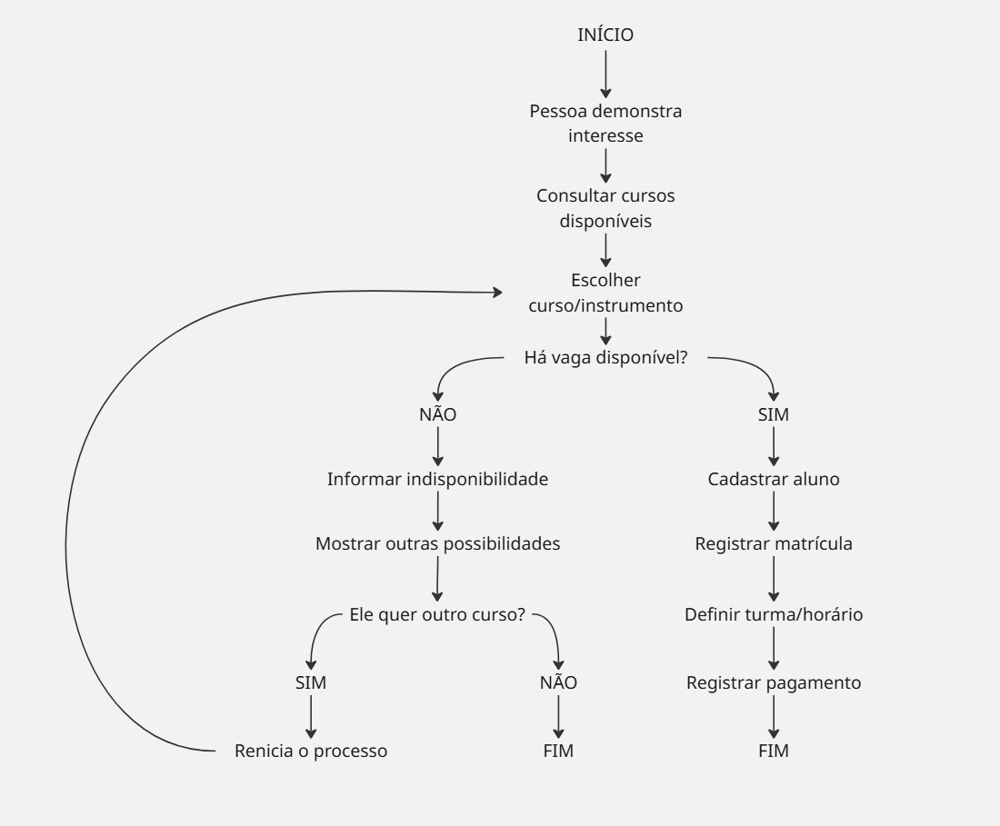
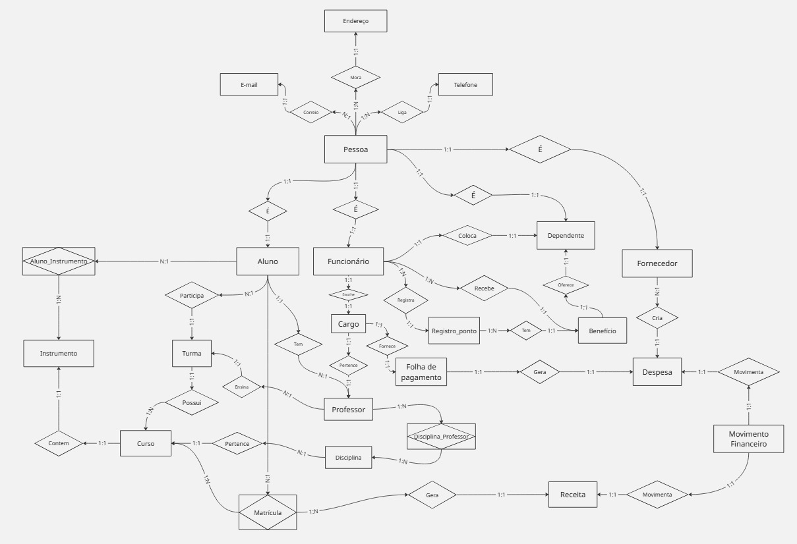

# Projeto ERP – Escola de Música Murbach

## 1. Identificação da equipe

...

## 2. Caracterização da empresa

...

## 3. Justificativa da escolha

...

## 4. Problemas identificados

...

## 5. Processos de negócio

...

## 6. Requisitos funcionais

...

## 7. Requisitos não funcionais

...

## 8. Regras de negócio

...

## 9. Restrições e políticas organizacionais

...

## 10. Fluxogramas

Os fluxogramas representam os principais processos do projeto.

## 11. Entidades

As principais entidades identificadas no projeto são:

- Pessoa
- Fornecedor
- Despesa
- Movimento Financeiro
- Receita
- Matrícula
- Curso
- Instrumento
- Aluno_Instrumento
- Aluno
- Turma
- Professor
- Disciplina
- Disciplina_Professor
- Funcionário
- Folha de Pagamento
- Registro Ponto
- Dependente
- Benefício
- Cargo
- Telefone
- E-mail
- Endereço

- ## 12. Atributos

### Pessoa
- CPF
- Nome
- Data de nascimento
- Telefone
- E-mail
- Endereço

### Aluno
- ID Aluno
- Nome
- CPF
- Data de nascimento
- Telefone
- E-mail
- Endereço
- Status

- ## 13. Relacionamentos

Os principais relacionamentos identificados foram:

- Pessoa — Mora — Endereço
- Pessoa — Tem — E-mail
- Pessoa — Possui — Telefone
- Pessoa — É — Aluno
- Pessoa — É — Funcionário
- Pessoa — É — Fornecedor
- Aluno — Participa — Turma
- Turma — Possui — Curso
- Disciplina — Pertence — Curso
- Curso — Contém — Instrumento
- Aluno — Tem — Professor
- Funcionário — Coloca — Dependente
- Funcionário — Recebe — Benefício
- Funcionário — Ocupa — Cargo
- Funcionário — Registra — Registro_Ponto
- Fornecedor — Gera — Despesa
- Matrícula — Gera — Receita

- ## 14. Cardinalidades

- Pessoa 1:N Endereço
- Pessoa 1:N E-mail
- Pessoa 1:N Telefone
- Pessoa 1:1 Aluno
- Pessoa 1:1 Funcionário
- Pessoa 1:1 Fornecedor
- Funcionário 1:N Registro_Ponto
- Funcionário 1:N Benefício
- Fornecedor 1:N Despesa
- Matrícula 1:N Receita

- ## 15. Dicionário de dados conceitual

O dicionário de dados apresenta as entidades, seus atributos,
descrições e regras/observações.

### Pessoa

| Atributo | Descrição | Regra/Observação |
|---|---|---|
| CPF | Cadastro da pessoa | Obrigatório e único |
| Nome | Nome completo | Obrigatório |
| Data_nascimento | Data de nascimento | Obrigatório |

## 16. DER

O Diagrama Entidade-Relacionamento representa graficamente
as entidades, atributos, relacionamentos e cardinalidades
do projeto.

## 17. Justificativas técnicas

As principais decisões de modelagem foram definidas com base
nas regras de negócio e na necessidade de organizar os dados
da escola de música.

## 18. Conclusão

O projeto de modelagem de banco de dados da Murbach Music School
permitiu identificar os principais processos, requisitos, regras
de negócio, entidades e relacionamentos da instituição.

A modelagem busca organizar as informações da escola, reduzindo
a dependência de controles manuais e facilitando o gerenciamento
de alunos, professores, funcionários, matrículas e informações
financeiras.
